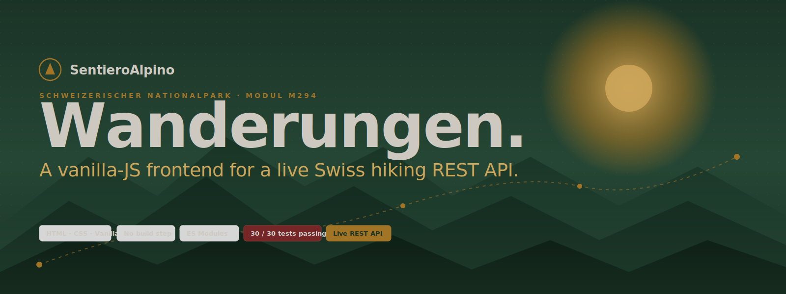
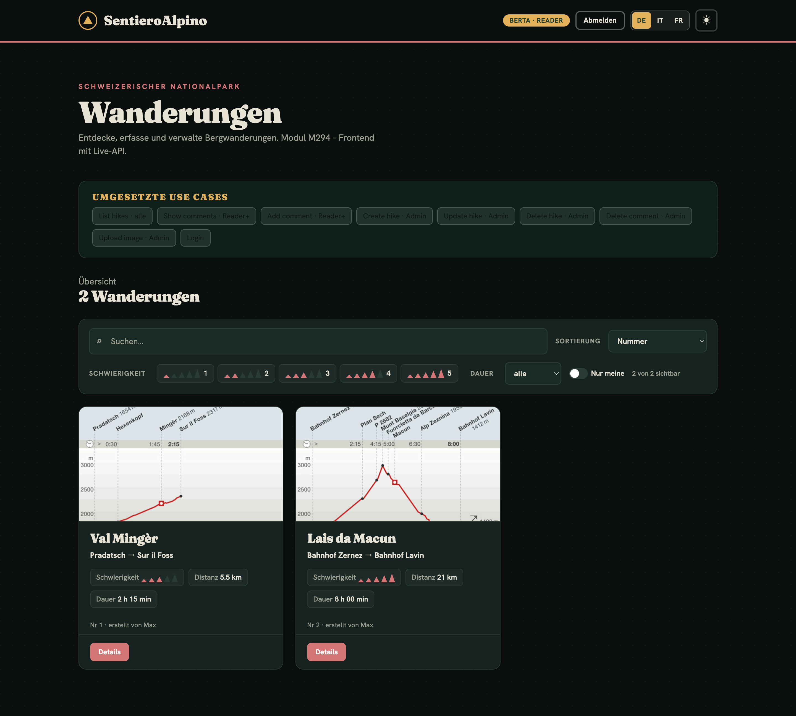
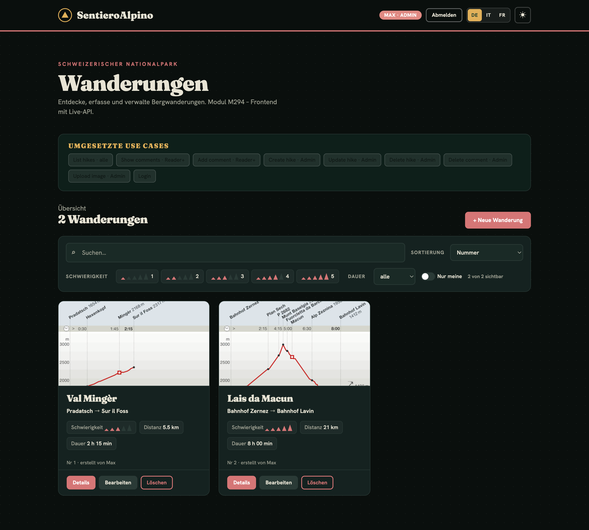
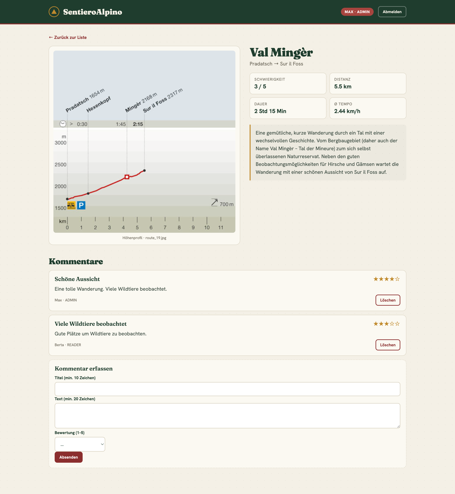
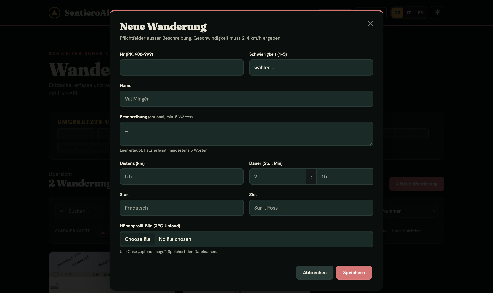
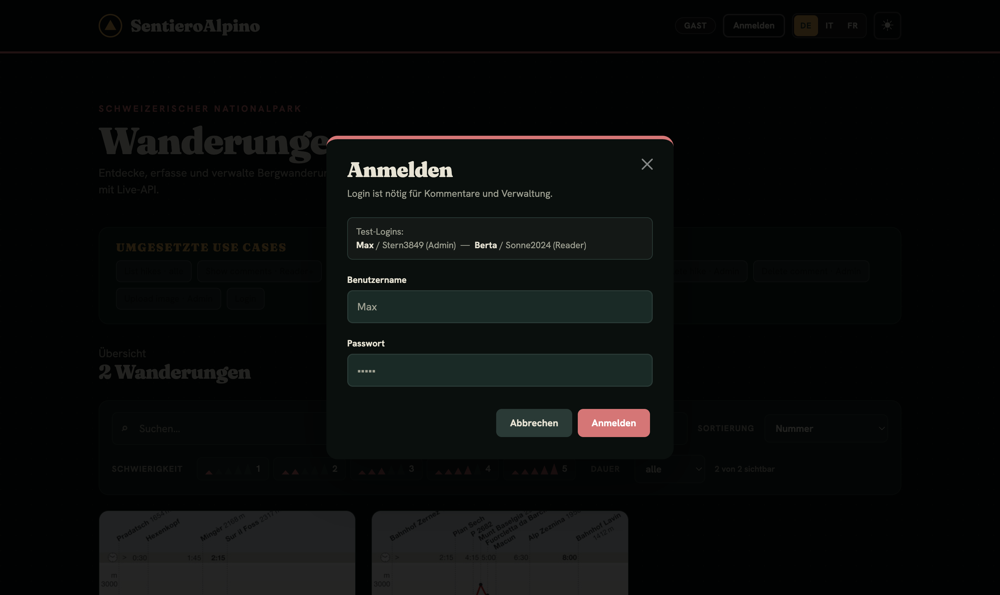
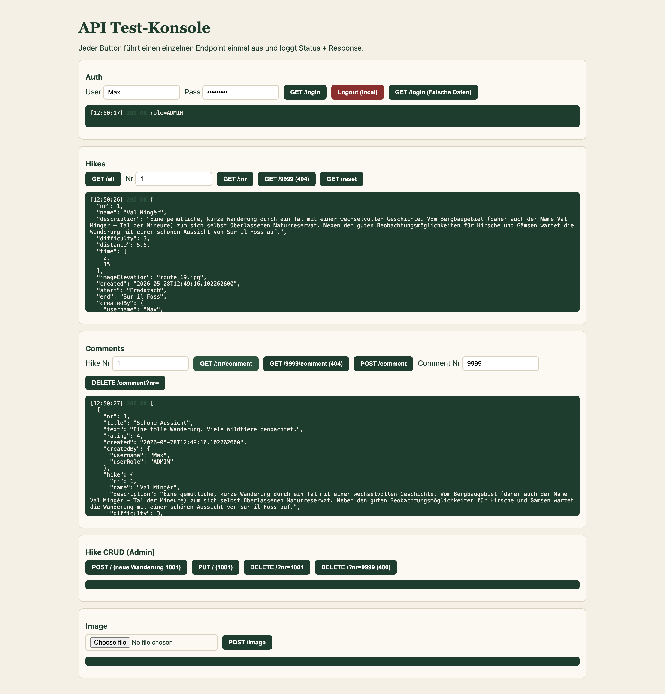
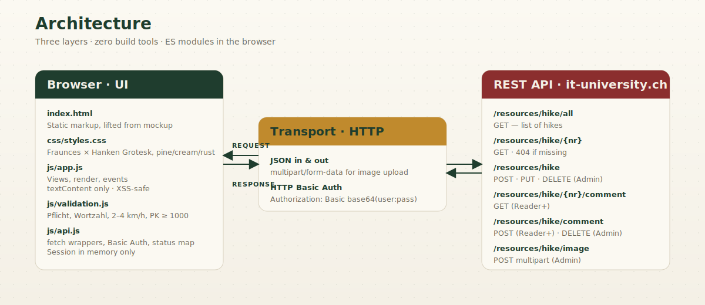

<!-- markdownlint-disable MD033 MD041 -->
<p align="center">
  
</p>

<p align="center">
  <a href="#-quickstart"></a>
  <a href="#-quickstart"></a>
  <a href="#-quickstart"></a>
  <a href="#-quickstart"></a>
  <a href="Testprotokoll.md"></a>
  <a href="#"></a>
</p>

<p align="center">
  <b>SentieroAlpino</b> &mdash; <i>Schweizerischer Nationalpark</i><br>
  Plain HTML/CSS/JS frontend for the <b>M294</b> hiking REST API. Two roles, ten use cases, zero build tools, one beautiful interface.
</p>

<p align="center">
<b>https://platret.github.io/sentiero-alpino/<b>
</p>

<p align="center">
  <a href="#-the-app">App</a> &middot;
  <a href="#-architecture">Architecture</a> &middot;
  <a href="#-api-surface">API</a> &middot;
  <a href="#-validation">Validation</a> &middot;
  <a href="#-security">Security</a> &middot;
  <a href="#-testing">Testing</a> &middot;
  <a href="#-quickstart">Quickstart</a>
</p>

---

## 🏔 The App

<table>
  <tr>
    <td width="50%" valign="top">
      <a href="docs/screenshots/01-list-guest.png"></a>
      <p align="center"><sub><b>List view · Guest</b><br>Every visitor sees the hikes immediately.</sub></p>
    </td>
    <td width="50%" valign="top">
      <a href="docs/screenshots/03-list-admin.png"></a>
      <p align="center"><sub><b>List view · Admin</b><br>"Bearbeiten" and "Löschen" surface for admins only.</sub></p>
    </td>
  </tr>
  <tr>
    <td width="50%" valign="top">
      <a href="docs/screenshots/04-detail.png"></a>
      <p align="center"><sub><b>Detail · elevation profile · comments</b><br>Real images from <code>/img/{filename}</code> on the live API.</sub></p>
    </td>
    <td width="50%" valign="top">
      <a href="docs/screenshots/05-hike-form.png"></a>
      <p align="center"><sub><b>Hike form · validation</b><br>Speed 2–4 km/h, PK 900–999, 5-word description floor.</sub></p>
    </td>
  </tr>
  <tr>
    <td width="50%" valign="top">
      <a href="docs/screenshots/02-login.png"></a>
      <p align="center"><sub><b>Login · HTTP Basic Auth</b><br>Credentials live in memory only — never localStorage, never the DOM.</sub></p>
    </td>
    <td width="50%" valign="top">
      <a href="docs/screenshots/06-test-console.png"></a>
      <p align="center"><sub><b>Test console</b><br>One button per endpoint &mdash; raw status &amp; response logged.</sub></p>
    </td>
  </tr>
</table>

---

## ✨ Highlights

<table>
<tr>
  <td width="33%" valign="top">
    <h3>🎨 Design-fidelity</h3>
    Markup &amp; CSS lifted verbatim from the approved mockup. <b>Fraunces × Hanken Grotesk</b>, pine / cream / rust / gold tokens. No frameworks. No utilities. Just hand-written CSS.
  </td>
  <td width="33%" valign="top">
    <h3>🌐 Live REST integration</h3>
    Every action talks to a real Tomcat backend &mdash; <code>GET</code>, <code>POST</code>, <code>PUT</code>, <code>DELETE</code>, <code>multipart/form-data</code>. CORS open. HTTP Basic Auth. JSON in &amp; out.
  </td>
  <td width="33%" valign="top">
    <h3>🔐 Role-gated</h3>
    <b>Guest → Reader → Admin.</b> Gates in the UI <i>and</i> re-checked before every protected request. Status codes mapped to humane German toasts.
  </td>
</tr>
<tr>
  <td width="33%" valign="top">
    <h3>🧪 30 / 30 black-box tests</h3>
    Every test case from <code>Testfaelle.xlsx</code> executed against the live API. Results, surprises, and API quirks documented in <a href="Testprotokoll.md"><code>Testprotokoll.md</code></a>.
  </td>
  <td width="33%" valign="top">
    <h3>🛡 Hardened</h3>
    All user content rendered via <code>textContent</code>. Passwords never leave the form. Session lives in memory. Logout clears everything. XSS-safe by construction.
  </td>
  <td width="33%" valign="top">
    <h3>📐 KISS &amp; DRY</h3>
    Eight files. Zero dependencies. Zero comments. <b>StandardJS</b>-conformant. Reads top-to-bottom in 15 minutes.
  </td>
</tr>
</table>

---

## 🧭 Architecture

<p align="center">
  
</p>

```
hike-frontend/
├─ index.html              ← markup lifted from mockup
├─ css/
│  └─ styles.css           ← Fraunces × Hanken Grotesk · pine/cream/rust
├─ js/
│  ├─ api.js               ← BASE_URL, Basic Auth, fetch wrappers, status map
│  ├─ validation.js        ← Pflicht · Wortzahl · 2–4 km/h · PK 900–999
│  └─ app.js               ← views, render, events, role gates
├─ test/
│  └─ test.html            ← one button per endpoint
├─ docs/                   ← hero, architecture, screenshots
├─ Testprotokoll.md        ← 30 / 30 test cases with live-API results
└─ README.md
```

---

## 🛰 API Surface

> **Base URL.** `https://it-university.ch/hike` &mdash; endpoints live under `/resources/hike/…`, images under `/img/{filename}`.
> Configured in [`js/api.js`](js/api.js) as a single `BASE_URL` constant.

<table>
<thead>
<tr><th align="left">Use case</th><th>Method</th><th align="left">Path</th><th>Auth</th><th>Status map</th></tr>
</thead>
<tbody>
<tr><td>List hikes</td><td><code>GET</code></td><td><code>/all</code></td><td>—</td><td>200</td></tr>
<tr><td>Get hike</td><td><code>GET</code></td><td><code>/{nr}</code></td><td>—</td><td>200 · 404</td></tr>
<tr><td>Get comments</td><td><code>GET</code></td><td><code>/{nr}/comment</code></td><td>Reader+</td><td>200 · 404</td></tr>
<tr><td>Add comment</td><td><code>POST</code></td><td><code>/comment</code></td><td>Reader+</td><td>200 · 400</td></tr>
<tr><td>Create hike</td><td><code>POST</code></td><td><code>/</code></td><td><b>Admin</b></td><td>200 · 400</td></tr>
<tr><td>Update hike</td><td><code>PUT</code></td><td><code>/</code></td><td><b>Admin</b></td><td>200 · 400</td></tr>
<tr><td>Delete hike</td><td><code>DELETE</code></td><td><code>/?nr={nr}</code></td><td><b>Admin</b></td><td>200 · 400</td></tr>
<tr><td>Delete comment</td><td><code>DELETE</code></td><td><code>/comment?nr={nr}</code></td><td><b>Admin</b></td><td>200 · 400</td></tr>
<tr><td>Upload image</td><td><code>POST</code></td><td><code>/image</code></td><td><b>Admin</b></td><td>200</td></tr>
<tr><td>Login</td><td><code>GET</code></td><td><code>/login</code></td><td>Basic</td><td>200 · 401</td></tr>
<tr><td>Reset seed</td><td><code>GET</code></td><td><code>/reset</code></td><td>—</td><td>200</td></tr>
</tbody>
</table>

### Data model

```jsonc
// Hike
{
  "nr": 901,
  "name": "Val Mingèr",
  "description": "Eine gemütliche, kurze Wanderung …",
  "difficulty": 3,           // 1–5
  "distance": 5.5,           // km
  "time": [2, 15],           // [hours, minutes]
  "imageElevation": "route_19.jpg",
  "created": "2026-04-17T16:09:51.907932700",
  "start": "Pradatsch",
  "end":   "Sur il Foss",
  "createdBy": { "username": "Max", "userRole": "ADMIN" }
}

// Comment — note the literal "hike" key
{
  "nr": 0,                    // 0 → server generates a random nr
  "title": "Schöne Aussicht",
  "text":  "Eine tolle Wanderung. Viele Wildtiere beobachtet.",
  "rating": 4,
  "created": "2026-04-17T16:09:51.907932700",
  "createdBy": { "username": "Berta", "userRole": "READER" },
  "hike": { /* full Hike object */ }
}
```

---

## ✅ Validation

> The server validates **only the primary key**. The frontend is therefore the single source of truth for all business rules.

| Rule | Where | Description |
|---|---|---|
| All fields required | hike form | except `description` |
| `description` | hike form | optional &mdash; if filled, ≥ 5 words |
| `difficulty` | hike form | integer 1–5 |
| `nr` (new hikes) | hike form | integer in **900–999** (assigned range), not duplicated |
| **Speed** | hike form | `distance / (h + m/60)` ∈ **[2, 4] km/h** inclusive |
| Title | comment | ≥ 10 characters |
| Text | comment | ≥ 20 characters |
| Rating | comment | integer 1–5 |
| Username / Password | login | both required |

---

## 🛡 Security

- 🧠 **Credentials in `sessionStorage` only.** Survive a tab refresh, never touch `localStorage`, never reach the DOM, never get logged. Cleared on logout and when the tab closes.
- 🚫 **Password never leaves the form.** Never serialized, never echoed, never sent to `createdBy`.
- 🧹 **XSS-safe rendering.** Every piece of user content goes through `textContent`. Zero `innerHTML` on user data.
- 🪪 **Role re-check before every protected call.** UI hiding is a hint, not a gate.
- 🔐 **HTTP Basic Auth** via `Authorization: Basic base64(user:pass)` header on every protected request.

### Error map

| Status | Toast |
|---|---|
| `401` | Nicht eingeloggt oder falsche Zugangsdaten. |
| `403` | Keine Berechtigung. |
| `404` | Nicht gefunden. |
| `400` | Ungültige Daten. |
| `0` (network) | API nicht erreichbar. |

---

## 🧪 Testing

**30 / 30** black-box test cases passing &mdash; full protocol in [`Testprotokoll.md`](Testprotokoll.md).

| Use case | Cases | Result |
|---|---|---|
| Login | 3 | ✅ 3 / 3 |
| List hikes | 3 | ✅ 3 / 3 |
| Show comments | 3 | ✅ 3 / 3 |
| Add comment | 4 | ✅ 4 / 4 |
| Create hike | 5 | ✅ 5 / 5 |
| Update hike | 3 | ✅ 3 / 3 |
| Delete hike | 3 | ✅ 3 / 3 |
| Delete comment | 3 | ✅ 3 / 3 |
| Upload image | 3 | ✅ 3 / 3 |

The standalone test console (`test/test.html`) fires each endpoint once and logs raw status + body, so the wiring can be verified in isolation.

### Live-API quirks discovered

- `PUT /` with an unknown `nr` returns **`400`** (not `404`).
- Authorization failures always return **`401`** (never `403`).
- The server accepts empty / invalid fields with `200` &mdash; the frontend is the only validation gate.
- Images are served at **`/hike/img/{filename}`**, not `/img/…`.

---

## ⚡ Quickstart

```bash
git clone https://github.com/platret/sentiero-alpino.git
cd sentiero-alpino
python3 -m http.server 8080
```

Then open:

- **App:** http://localhost:8080/index.html
- **Test console:** http://localhost:8080/test/test.html

> ES Modules require an HTTP origin &mdash; opening `index.html` via `file://` will not load `js/app.js`.

### Test users

| User    | Password    | Role     |
|---------|-------------|----------|
| `Max`   | `Stern3849` | `ADMIN`  |
| `Berta` | `Sonne2024` | `READER` |

---

## 🎨 Design tokens

| Token | Hex | Use |
|---|---|---|
| `--pine` | `#1f3d2e` | header, primary text |
| `--pine2` | `#2d543f` | hover, success toast |
| `--cream` | `#f4f0e6` | page background |
| `--paper` | `#fbf9f2` | card surfaces |
| `--rust` | `#8b2e2e` | accents, primary CTA, error |
| `--rust2` | `#a8453f` | hover state |
| `--gold` | `#c08a2d` | brand mark, stars, badges |
| `--stone` | `#6f6a5d` | secondary text |
| `--line` | `#d9d2c0` | borders |

**Type pair:** [`Fraunces`](https://fonts.google.com/specimen/Fraunces) (serif display, opsz 9–144, weight 900) × [`Hanken Grotesk`](https://fonts.google.com/specimen/Hanken+Grotesk) (sans body, 400–700).

---

## 📜 License & credits

Built for **Modul M294** at the Swiss apprenticeship school, **LB 2** (2026).
REST backend kindly hosted at [`it-university.ch/hike`](https://it-university.ch/hike).

<p align="right"><sub>SentieroAlpino · Made with vanilla JS in the Engadin spirit.</sub></p>
